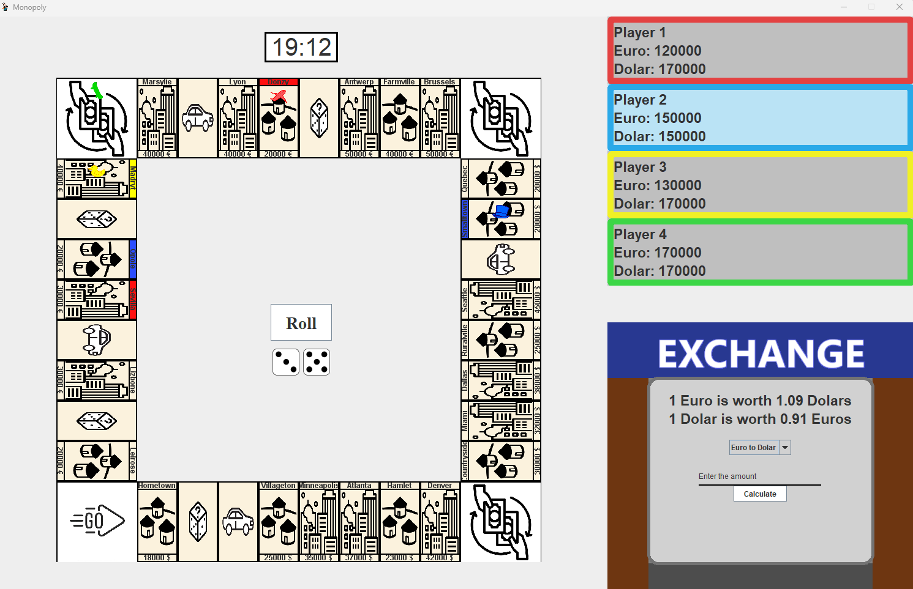
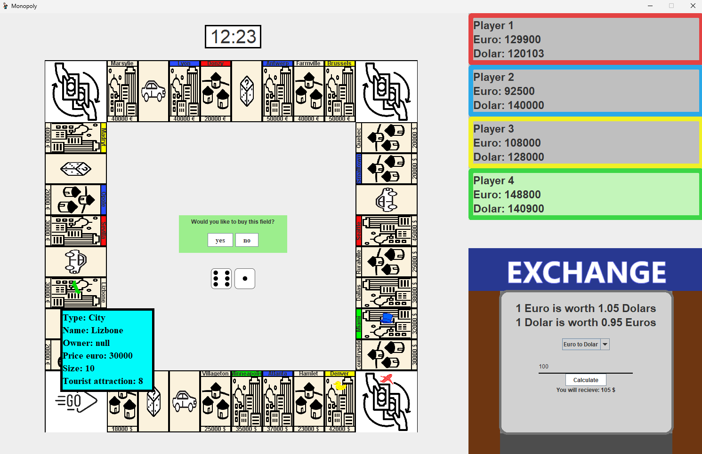

# Monopoly Game 🎲

A Java-based implementation of the classic Monopoly game, where players can buy city properties, build buildings, and make strategic financial decisions. Players take turns moving around the board, landing on different types of spaces that offer various opportunities and challenges.

The game board includes city property fields that players can purchase, allowing them to build houses and hotels. There are also special spaces, such as the Chance field, where players draw a card that can lead to various events, and the Car field, where players can purchase a car to make moving around the board easier.

A unique feature of this game is the currency exchange system. Players start with a balances in dollars (USD) and euros (EUR), and they can exchange one currency for another when they land on the Exchange field. The exchange rate between the two currencies is not fixed – it fluctuates dynamically based on events happening on the board, making currency management an important strategic element.

---

## 🛠 **Technologies Used**

- Java
- Strategy Pattern
- Observer Pattern 

---

## 🤝 **Team**

- [Tomasz](https://github.com/tomasz-trela)
- [Stanislaw](https://github.com/stanislawkaczmarek1)
- [Mateusz](https://github.com/ozzy-420)
- [Mikolaj](https://github.com/Drake3001)
- [MateuszJ](https://github.com/mjaniszewski21)
- [Dawid](https://github.com/DawidWyskwarski)
- [Lukasz](https://github.com/luklen123)
- [Maciej](https://github.com/Orio77)

---

## 📸 **Screenshots**

---
